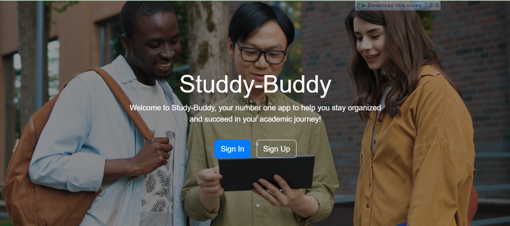
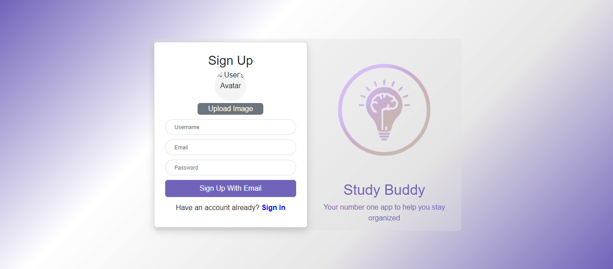
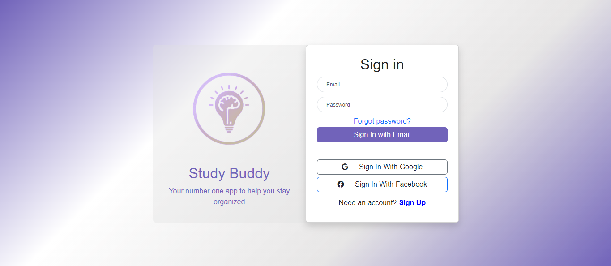
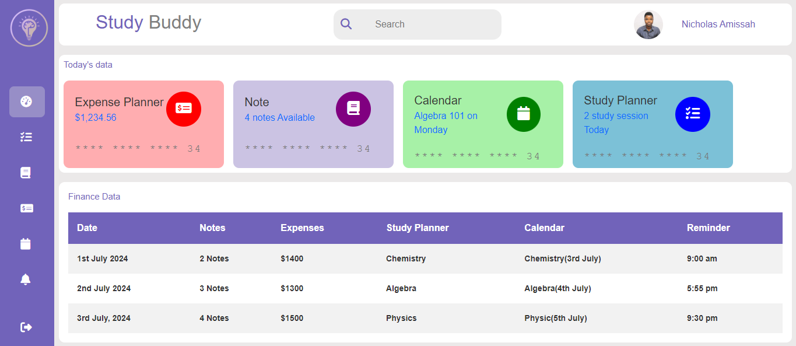
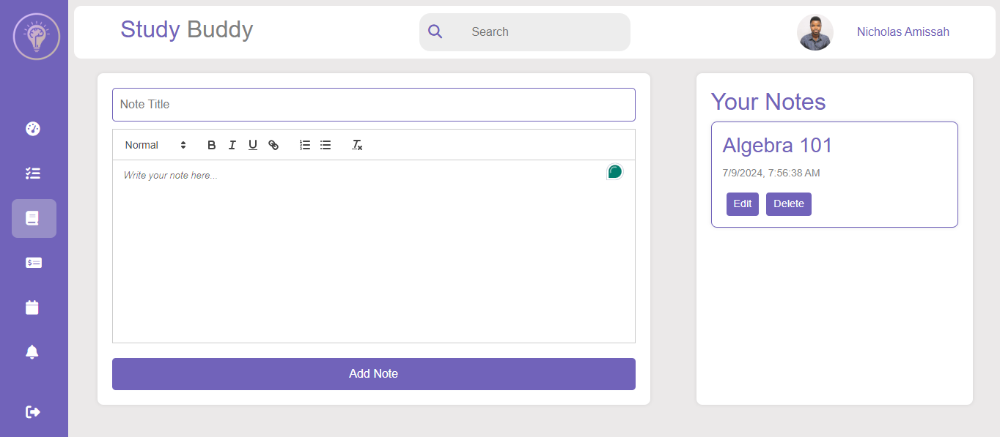
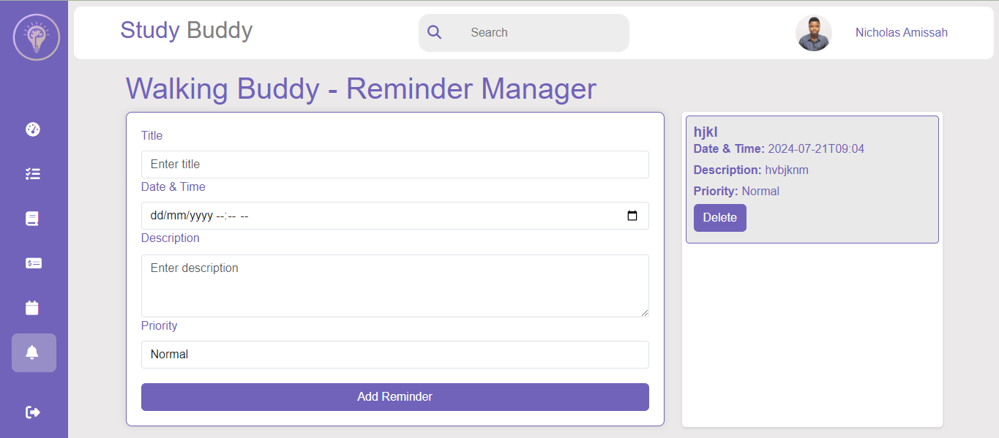
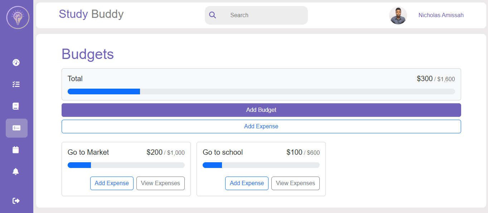
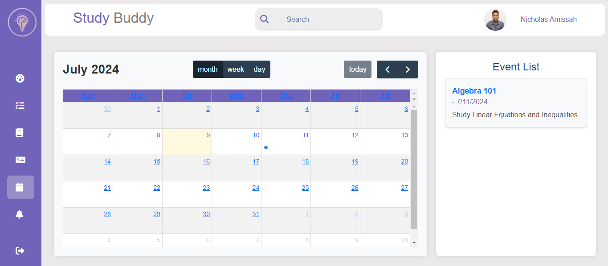
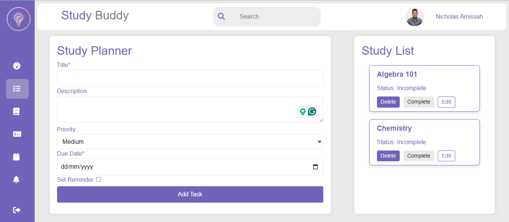

<a name="readme-top"></a>

<div align="center">


</div>
<!-- TABLE OF CONTENTS -->

# 📗 Table of Contents

- [📗 Table of Contents](#-table-of-contents)
- [📖 StudyBuddy ](#-StudyBuddy)
  - [Live Demo](#live-demo)
  - [🛠 Built With ](#-built-with-)
    - [Tech Stack ](#tech-stack-)
    - [Key Features ](#key-features-)
  - [💻 Getting Started ](#-getting-started-)
    - [Prerequisites](#prerequisites)
    - [Setup](#setup)
    - [Install](#install)
    - [Usage](#usage)
    - [Run tests](#run-tests)
  - [👥 Authors ](#-authors-)
  - [🔭 Future Features ](#-future-features-)
  - [🤝 Contributing ](#-contributing-)
  - [⭐️ Show your support ](#️-show-your-support-)
  - [🙏 Acknowledgments ](#-acknowledgments-)
  - [❓ FAQ (OPTIONAL) ](#-faq-optional-)
  - [📝 License ](#-license-)

<!-- PROJECT DESCRIPTION -->

# StudyBuddy <a name="about-project"></a>

> Welcome to the StudyBuddy! This is a personal assistant created for students to help them manage their life in school. The buddy can serve them with reminders, help them manage their expenses, and be able to take notes even in class. 


### Live Demo

[Live Demo Link](https://walking-buddy-636cb.web.app/)

## 🛠 Built With <a name="built-with"></a>

### Tech Stack <a name="tech-stack"></a>

<details>
  <summary>Frontend</summary>
  <ul>
    <li><a href="https://getbootstrap.com/">Bootstrap</a></li>
    <li><a href="https://www.javascript.com/">JavaScript</a></li>
    <li><a href="https://react.dev/">React.js</a></li>
  </ul>
</details>
<details>
  <summary>Server</summary>
  <ul>
    <li><a href="https://firebase.google.com/">FireBase</a></li>
  </ul>
</details>
<details>
  <summary>Libraries</summary>
  <ul>
    <li><a href="https://firebase.google.com/">fullCalendar</a></li>
    <li><a href="https://firebase.google.com/">Formik</a></li>
    <li><a href="https://firebase.google.com/">react-bootstrap</a></li>
    <li><a href="https://firebase.google.com/">react-quill</a></li>
  </ul>
</details>
<!-- Features -->

### Key Features <a name="key-features"></a>

### **Welcome Page**


### **Signup page**


### **Login page**


### **Dashboard**


### **Notes page**


### **Reminder page**


### **Expense page**


### **Calendar**


### **Study Planner**



<p align="right">(<a href="#readme-top">back to top</a>)</p>

## 💻 Getting Started <a name="getting-started"></a>

### Prerequisites

To run this project you need to configure your code editor with HTML, CSS & JS, and some other important extensions


### Install

Install this project with:

```
git clone https://github.com/atok624/StudyBuddy
```

### Usage

To run the project, execute the following command:

```
  cd StudyBuddy
  npm install

  npm start
```

<p align="right">(<a href="#readme-top">back to top</a>)</p>

<!-- AUTHORS -->

## 👥 Authors <a name="authors"></a>

👤 **Nicholas Amissah 💻**
- GitHub: [Github](https://github.com/atok624)
- Twitter: [Twitter](https://twitter.com/mysticalamissah)
- LinkedIn: [LinkedIn](https://linkedin.com/in/nicholas-amissah-153b09154)

<p align="right">(<a href="#readme-top">back to top</a>)</p>

<!-- FUTURE FEATURES -->

## 🔭 Future Features <a name="future-features"></a>
- **Weather API Integration**

<p align="right">(<a href="#readme-top">back to top</a>)</p>

<!-- CONTRIBUTING -->

## 🤝 Contributing <a name="contributing"></a>

Contributions, issues, and feature requests are welcome!

Feel free to check the [issues page](../../issues/).

<p align="right">(<a href="#readme-top">back to top</a>)</p>

<!-- SUPPORT -->

## ⭐️ Show your support <a name="support"></a>

If you like this project, please clone it and try it. I know you're going to love it

<p align="right">(<a href="#readme-top">back to top</a>)</p>

<!-- ACKNOWLEDGEMENTS -->

## 🙏 Acknowledgments <a name="acknowledgements"></a>

I want to thank **Emmanuel Fiifi Essel** and **Roberta Akoto** for the project idea. I am also grateful to Generation Ghana for providing me with the knowledge to build an amazing project like this. Also to **Code Info** for the idea for the dashboard. Additionally, I appreciate **Seyram Abofra**, **Gideon Agyage**, **Frances Obaze**, and **Maris Amu** for their invaluable support and feedback.


<p align="right">(<a href="#readme-top">back to top</a>)</p>

<!-- FAQ (optional) -->

## ❓ FAQ (OPTIONAL) <a name="faq"></a>

- **Can I fork the project and make a contribution?**

  Of course, you can! First, fork it and contribute to it.

- **How should I ask a pull request**

  - Step 1: Click on the pull request button
  - Step 2: create pull request

<p align="right">(<a href="#readme-top">back to top</a>)</p>

<!-- LICENSE -->

## 📝 License <a name="license"></a>

This project is [MIT](./LICENSE) licensed.

<p align="right">(<a href="#readme-top">back to top</a>)</p>
